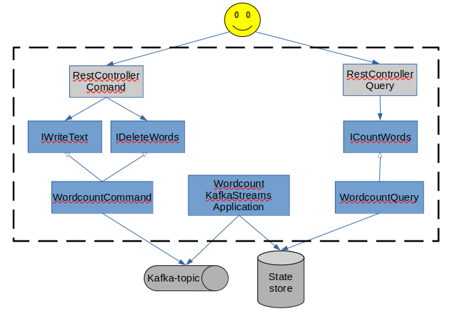

:fr: Sommaire / :gb: Table of Contents
=================

<!--ts-->
   * [French Documentation](#fr-poc-kafka-streams-sur-wordcount)
   * [English Documentation](#gb-proof-of-concept-kafka-streams-on-wordcount-problem)

---

# :fr: POC kafka-streams sur wordcount

## Présentation

Ce projet implémente un "wordcount", dont le but est de compter les mots entrés par l'utilisateur.

"Wordcount" a souvent été qualifié comme étant le "Hello World!" du big data. 
C'est un bon exercice pour prendre en main une technologie, comme Hadoop ou Spark. 

Ce projet fait partie d'un ensemble de mini projets persos, dont le but est de me familiariser avec Kafka Streams.

Pourquoi ? Par simple curiosité pour commencer, c'est une technologie qui m'intrigue depuis un moment, 
qui vient compléter mes connaissances et compétence de Kafka "classique", et ça fait une corde de plus à mon arc

## Pré-requis

- `java jdk 11+`
- `docker` 
    - https://docs.docker.com/engine/install/ubuntu/ pour un guide d'installation de `docker` sur Ubuntu
- `docker-compose`
    - https://docs.docker.com/compose/install/ pour un guide d'installation de `docker-compose`

## Utilisation de l'application

### "Installation"

`mvn clean install`

### Lancement

1. Démarrer Kafka : `docker-compose down && docker-compose up` 
2. Démarrer l'application :
    - via l'IDE de votre choix
    - via maven: `mvn spring-boot:run`

### Ajouter du texte

`curl -X POST -d 'Hello World' http://localhost:8080/write`

### Compter les mots ajoutés 

```
> curl -X GET localhost:8080/count
{"Hello":1,"World":1}
```

### Supprimer un mot
`curl -X DELETE localhost:8080/word/{word}`

par exemple:

`curl -X DELETE localhost:8080/word/hello`

### Supprimer tous les mots
`curl -X DELETE localhost:8080/all`

## Quelques commandes utiles
reset une application kafka-streams:
```
docker exec -it word-count-kafka-streams-cqrs_kafka_1 kafka-streams-application-reset --bootstrap-servers kafka:9092 --application-id wordcount
```

lister les topics:
```
docker exec -it word-count-kafka-streams-cqrs_kafka_1 kafka-topics --bootstrap-server kafka:9092 --list
```

## Architecture et Design


# :gb: Proof-of-Concept kafka-streams, on "wordcount" problem

## Presentation

This projects implements a "wordcount", whose goal is to ... count words ...

"Wordcount" has often been said to be the "Hello World!" of so called "big data".
This is a good exercise for proofs of concept, and try some tool or framework, like Hadoop, Spark, or here Kafka Streams, 
for example.

This project is part of a series, whose aim is to help me skill up with Kafka Streams, and showcase what i learned. 

Why Kafka Streams ? Out of curiosity to begin with, this is a technology that has been intriguing me for quite some time now,
and i already know "vanilla" Kafka pretty well, so that seems like a good fit, and a good tool to have under your belt.

## Pre-requisite

- `java jdk 11+`
- `docker` 
    - https://docs.docker.com/engine/install/ubuntu/ for an installation guide on Ubuntu
- `docker-compose`
    - https://docs.docker.com/compose/install/ 

## Using the application

### "Installation"

`mvn clean install`

### Starting the application

1. Start Kafka : `docker-compose down && docker-compose up` 
2. Start the application :
    - with the IDE of your choice
    - with maven: `mvn spring-boot:run`
    
### Add text

`curl -X POST -d 'Hello World' http://localhost:8080/write`

### Count words 

```
> curl -X GET localhost:8080/count
{"Hello":1,"World":1}
```

### Delete a word
`curl -X DELETE localhost:8080/word/{word}`

for example:

`curl -X DELETE localhost:8080/word/hello`

### Delete all words
`curl -X DELETE localhost:8080/all`

## Some useful commands
reset a kafka-streams application:
```
docker exec -it word-count-kafka-streams-cqrs_kafka_1 kafka-streams-application-reset --bootstrap-servers kafka:9092 --application-id wordcount
```

list topics:
```
docker exec -it word-count-kafka-streams-cqrs_kafka_1 kafka-topics --bootstrap-server kafka:9092 --list
```

## Architecture and Design
